# Watson AIOps Demo Guide

## Prerequisites
There are several steps that you will need to take to ensure a successful demo.

Please make sure that you have followed the steps to [prepare for the demo](./PREPARE_DEMO.md) and/or watch my [video walkthrough](https://ibm.box.com/s/nacwbqzkc71x7t9emv0v8j2r795k0pwz).

## Demo 


### Intro

You should start your demo by showing the [Bookinfo Application](http://istio-ingressgateway-istio-system.tec-cp4aiops-3c14aa1ff2da1901bfc7ad8b495c85d9-0000.eu-de.containers.appdomain.cloud/productpage)

Here you should explain the architecture of Bookinfo

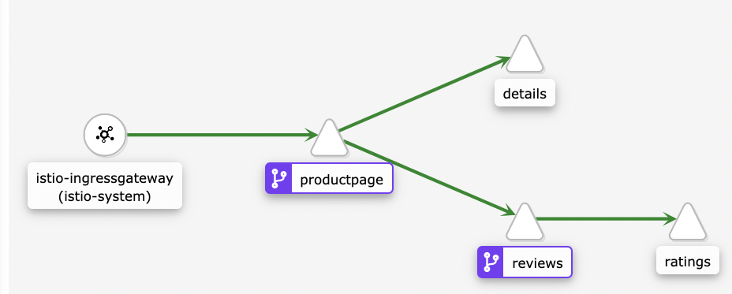


And the mapping of the page elements

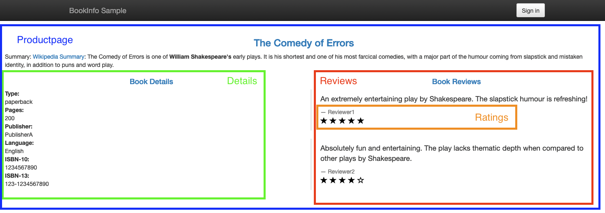

### Simulate incident

**Make sure you are logged-in to the Kubernetes Cluster first** (see chapter Prerequisites)

In the terminal type 

```bash
cd demo
./gitpush_bookinfo.sh
```


**Script**:
> I will now do a simulated push of new code to the Bookinfo Git Repository.


This will simulate a push to the Bookinfo Git Repository with all the Events and Logs being simulated that lead to an outage of the Ratings Service.

Go back to back to the [Bookinfo Application](http://istio-ingressgateway-istio-system.tec-cp4aiops-3c14aa1ff2da1901bfc7ad8b495c85d9-0000.eu-de.containers.appdomain.cloud/productpage) and show that the Ratings service has a failure now.


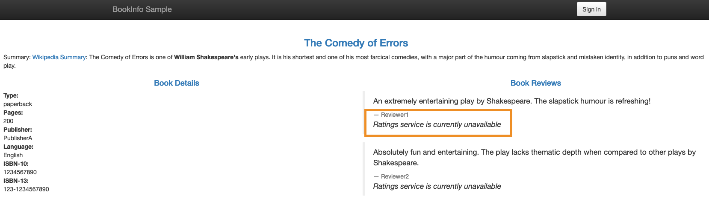

**Script**:
> As you can see the application is still running, however it is no longer returning product reviews. This is a key service for customer to evaluate how good a product is, and it is no longer working, which may well result in loss of sales.


### Slack

**Script**:


1. Switch to the Slack channel and show the Story for `Bookinfo` that you selected in the Preparation step.

	> I will now demonstrate our AIOps capabilities using a ChatOps workflow. ChatOps empowers high-performing, cross-functional and, often, global or remote teams especially in these times  to get notified, investigate, collaborate with key SMEs and solve the problem in one platform without the need of emails, phone calls, tool switching and meetings.
		
	> In this scenario, the team I am working with has embraced ChatOps and uses Slack as our collaboration platform. So right now I am heads down working when I see a notification from Watson AIOps about a problem.

	> As I get to the Slack channel, Watson AIOps gives me a succinct report of key information telling me:
	
	> 1. There’s a problem happening that I need to pay attention to.
	
	> 2. A pointer to where the problem is and other services that might be affected.
	
	> 3.	Synthesized evidence and advice to diagnose and resolve the situation.
	
	> This is key as an IT Operator. Without Watson AIOPs, I had to work through pages and pages of high priority alerts that were more noisy than helpful.
	
	> Let's break down this message before diving into the details.
	


1. Explain the basic information in the Story (Title, Description, Replies)

	> * First, Watson AIOps presents a high-level summary of the potential issue with an initial title, description, and severity based on evidence grouped in the background.
	> * The title and description are distilled from the extracted entities using NLP from the evidence data. In this issue Watson AIOps has autogenerated the title based on the pods impacted and the number of events correlated.
	
	
1. Go to `Relevant events`

	> * In this specific example, Watson AIOPs is alerting that an event has occurred in the BookInfo application and there are several events correlated from different components of application and succulently presented here.
	> * Now let’s dig into the evidence.
	> * As previously mentioned, Watson AIOps algorithms connect my siloed data sources to synthesize a single holistic problem report.
	> * Watson AIOps has grouped a diverse set of log anomalies and alerts together based on spatial and temporal reasoning as well as similarity to past situations.
	>       * Behind the scenes, this leverages pre-built models and unsupervised ML training on 'what normal means' in my environment.
	> *	Watson AIOps shows me the specific data points that were correlated so I can gain confidence in the synthesized report. If I want to see the source data, I can always link in context to the originating tool.

1. Click `View Relevant Events` 
1. **DO NOT** click on `Attach template logs` as this messes up the stream

	> * As you can see, Watson AIOps has grouped several Events in this one Story. 
	> * There are simple alerts having been triggered from sources like Metrics Manager, Humio, Sysdig, Falco, Prometheus Alertmanager, Git, and many more. 
	> * But we find detected Log Anomalies as well. 
	> * Everything grouped in one nice package, ready for me to dive in and understand the problem I'm facing.
	
1. Click `Show More`, `Preview Logs`

	> * Click on `preview logs` and show that there has been an anomaly detected and that the Ratings Service is unreachable.
	> * I can also look at the log anomalies. For Watson AIOps, an anomaly is the occurrence of message patterns (as shown here) that are not seen in the normal operation of the product. Watson AIOps helps me read every log message that is coming and understand the impact, and then notifies me only when necessary. I no longer worry about issues I have never seen before.

1. Click on `Search Recommended Actions` and select `Search` - explain Similar Incidents, NLP, ...

	> * I have not seen this particular problem before, so I hope Watson AIOps can help me leverage expertise from my team in similar past incidents and identify potential root causes even before I have done deep investigation into the problem.
	> * Behind the scenes, Watson AIOps uses Watson NLP to mine human language and historical knowledge - from ServiceNow tickets or as in this demo from GitHub Issues - to understand the content in previous tickets to identify and extract resolution actions automatically.
	> * This saves time for my team – with relevant content in the ticket, we’re able to share the knowledge.
	> * It's easy to see as well why Watson AIOps considers this relevant based on the services affected and nature of the problem. The first recommended action looks good, let's look deeper.
	> * Now when I click on the proposed solution it takes me to a GitHub Issue that tells me that last time this type of problem has been resolved by scaling back up the Ratings deployment and that there is an automated Runbook available.
	> * So I would be able to correct the problem right here and right now, but let's dig a little bit deeper in the information

1. Go to `Localization and Blast Radius`

	> *	 To better understand the localization and the effects of the outage, Watson AIOps shows me a hypothesized source of the problem and the blast radius - what else might be affected based on an understanding of the application topology.


1. Click on `View Relationships` - explain

	> * At one glance, I can immediately see the pods and services impacted and the potential blast radius of this emerging issue designated by the numbers 1 and 2.
	> * Watson AIOps shows me a hypothesized location of the event and the next most distant dependencies to help me understand the potential blast radius of the problem.
	> * In the background Watson AIOps uses a built-in dynamic topology mapping service to understand dependencies and relationships within my application.
	> * Watson AIOps shows me more granular relationships based on topology understanding designated by numbers 1 and 2. I can see the pods impacted and the services impacted with in the pods.
	> * In can also see a graphical representation of the information.

1. Click on `View Blast Radius` - this takes you to the Event Manager

	> * Now let's take a closer look at the Blast Radius
	> * The localization and blast radius reasoning is based on topology understanding, timeline, and entity names where the evidence is coming from.


### Event Manager and Topology


1. Select `4`from the dropdown and click on `Render` - This shows you the topology with the affected elements

	> * First let's get a bigger picture of where my problem is located and how it affects surrounding elements

	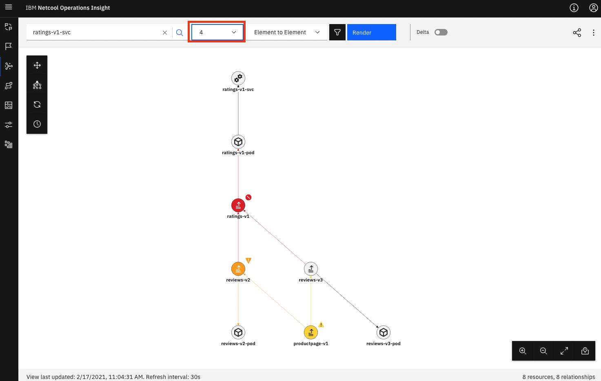

1. Right click on `ratings-v1` and select `Resource Status` - Talk about Events

	> * When checking for the Ratings Service, I can see that there has been a critical Event created on this component
	
	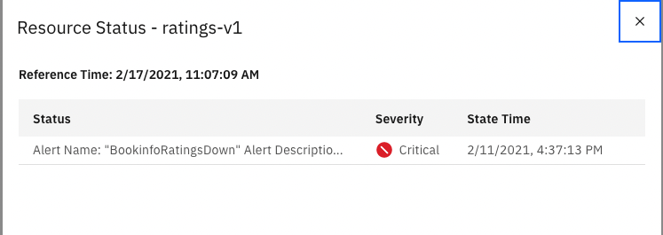


1. Click on `Events` in the left hand menu and select `DEMO` view in the dropdown - this brings you to the list of Events 

	> * Now let's take a look at all the events that made up the Slack Message

	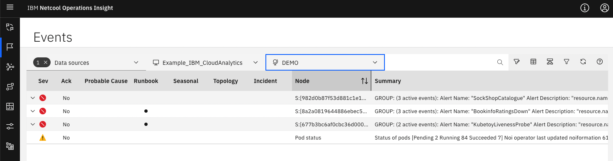


1. Open the Group for Bookinfo

	
	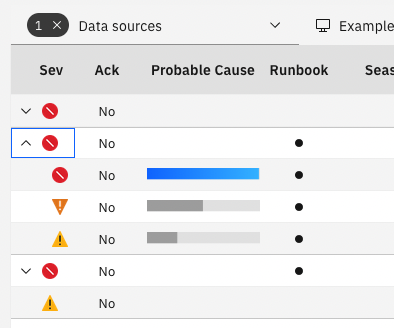


1. Click on the line with `ratings-v1`
2. Open `Scope Based Correlation` - Explain

	> * There are different ways in which Watson AIOps can correlate and group Events.
	> * The first way is through Scope Based Correlation, this groups similar events based on their Scope

4. Open `Temporal Correlation` - Explain (click on `More information` if you want to show more detail)

	> * The Second way is through Temporal Correlation, this groups Events that regularly occur together
	> * You can see that the grouped events have been 
	
	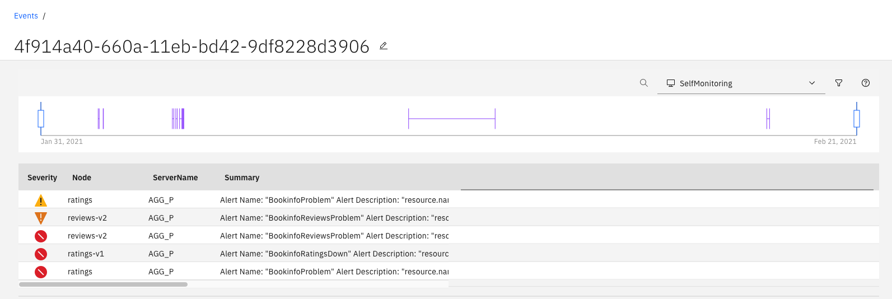
	
1. Open `Topology Correlation` - Explain - click on `More information`

	> * Topology Correlation works by grouping events that happen on adjacent nodes on the topology graph
	> * Let's take a closer look at the Bookinfo App Topology 
	
2. Explain Topology more in-depth if you have time. You could for example type `front-end' in the search box and show how to create the topology for the Sockshop Application

	2. Create Sockshop Topology
	
		> * You can create your custom topology views.
		> * Let's create the topology for another demo Application called Sockshop
		> * Starting with the main page called `front-end`
		
		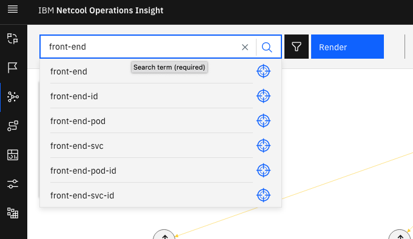
		
		> * So I select to seed the view with the Frontend Deployment
			
		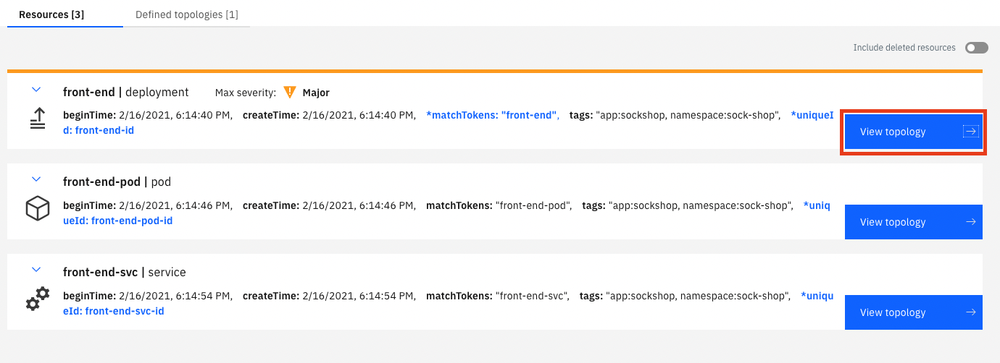
		
		Increase level to 4 - click `Render`
	
		> * Let's get some more information
	
		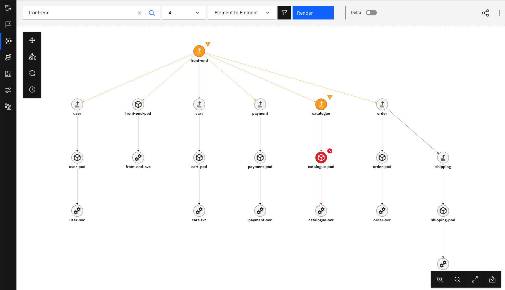
	
		> * And voilà I have a complete overview of the dependencies of my Sock Shop Application
	
	2. Show Delta

		> * With the topology tool, I also have the ability to track back, and see what has changed over time, If I turn on the “Delta” function, I am able to select a time period and see the changes in the Topology
		> * Let's enable the functionality
	
		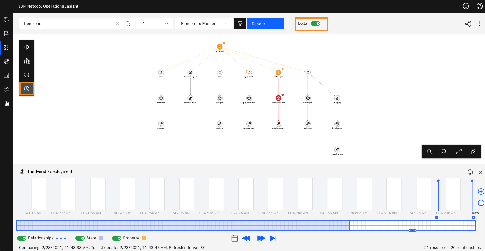
		
		> * The Catalog Servcie has an issue (it's red). To examine the last changes it had, I right click on it and select `Show last change in timeline` 
	
		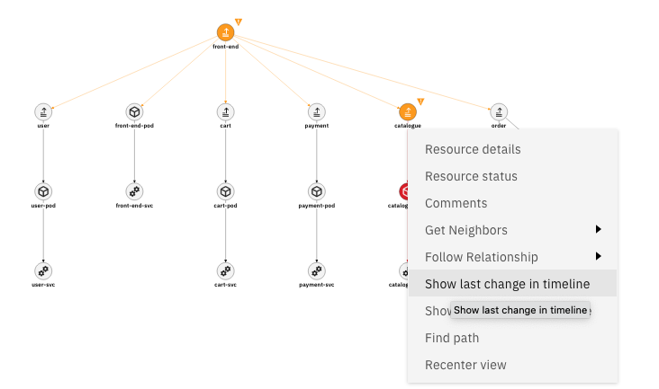
		
		> * This teleports me to the last change performed on this component, so here I can see that there have been added properties and relationships when the service was initially deployed.
	
		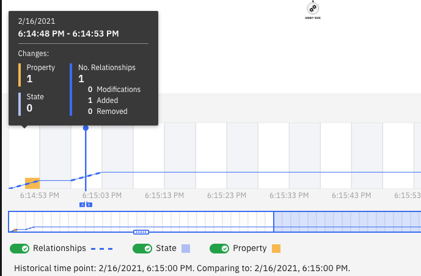
		

### Mitigate the Problem


1. Go back to the Event List 

	> * Now that we have gotten a good grasp at the localization, side effects of the outage, I will mitigate the problem.

2. Open `Runbook`

	> * As we have seen in the GitHub Issue, a fellow SRE has created a Runbook to correct this problem.
	> * In addition to that the Runbook is even automated, so no need to run through manual steps.
	
	
	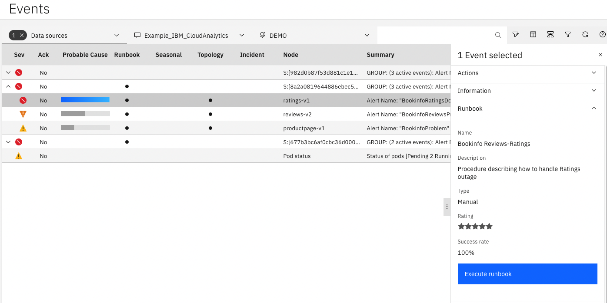


2. Click `Execute Runbook`

	> * I go the Runbook 

3. Click `Start Runbook`

	> * Start it Runbook 

4. Click `Run` - this takes a moment

	> * And run the mitigation 
	> * This can take a minute or two, so let's wait 

5. Show the script that has been executed 

	> * When finished, I can see the actions that has been executed

3. Click `Next Step`
4. Click `Complete`
5. Rate the Runbook

	> * Ok, done. Let's rate the Runbook and tell Watson AIOps that it has worked as planned.

4. Click `Runbook Worked`


5. Go back to back to the [Bookinfo Application](http://istio-ingressgateway-istio-system.tec-cp4aiops-3c14aa1ff2da1901bfc7ad8b495c85d9-0000.eu-de.containers.appdomain.cloud/productpage) and show that the Ratings service is working now.

	> * Ok, done. We can see that the Ratings Service is back up.


### What have we seen


> * The demo that I have just walked you through has the following flow


> * The IT environement (based on Kubernetes, Applications, ...) creates logs that are being fed into a Log Management Tool (Humio in this case).

> * The Log Management Tool (Humio) generates Alerts when it detects a Problem and sends them into the Event Manager (Netcool Operations Insight).

> * Event Manager can ingest Alerts from various sources like Metrics Manager, Humio, Sysdig, Falco, Prometheus Alertmanager, Git, and many more.

> * Which in turn sends them to the AI Manager for Event Grouping.

> * At the same time AI Manager ingests the raw logs coming from the Log Management Tool (Humio) and looks for anomalies in the stream based on the trained model.
> * If it finds an anomaly it forwards it to the Event Grouping as well.

> * Out of this, AI Manager creates a Story that is being enriched with Topology (Localization and Blast Radius) and with Similar Incidents that might help correct the problem.

> * The Story is then sent to Slack.

