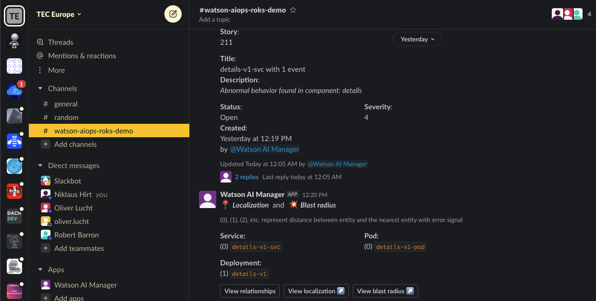
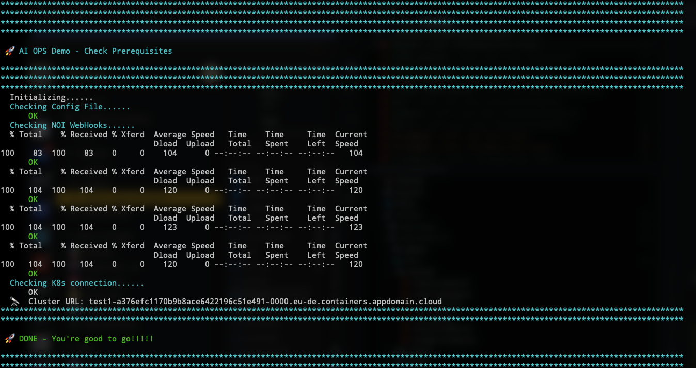
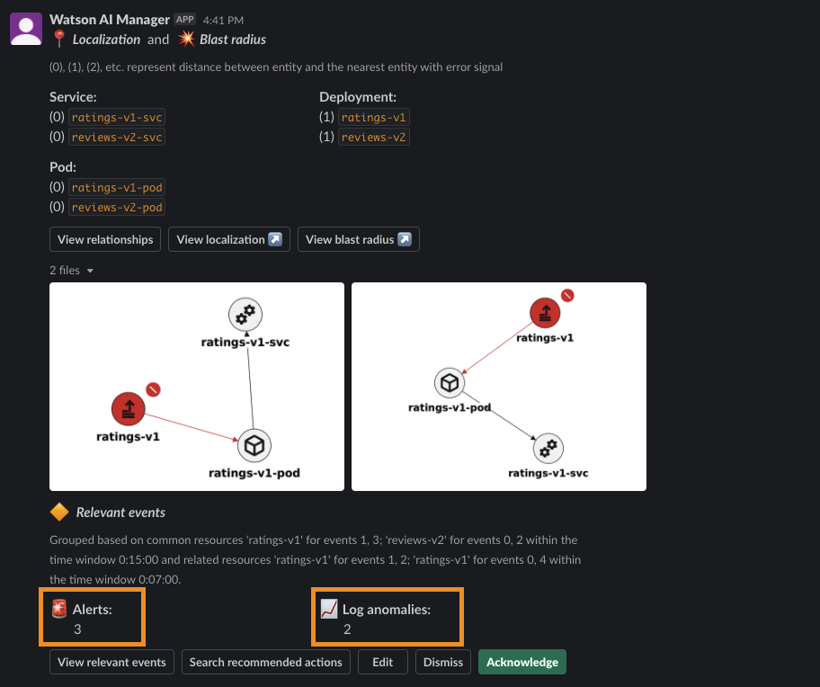

# Watson AIOps Demo Setup

## Prerequisites
There are several steps that you will need to take to ensure a successful demo.

By now you should have been invited to the Sclakc channel and received an email with the following elements:

* PDF Document - with URLs and logins for the different components
* `oc login` - command for the Demo Kubernetes Cluster
* 01_config.sh file - to parametrise the demo script


Make sure that you have done the following:

1. Download the demo repository at [https://github.ibm.com/NIKH/aiops-demo](https://github.ibm.com/NIKH/aiops-demo)


1. Check that you can access the Slack workspace `TEC Europe` and channel `#watson-aiops-roks-demo`

	
	


0. Login to the Kubernetes Cluster with the `oc login` command that you have *received by mail*
0. Copy the `01_config.sh` file that you have *received by mail* into the `./demo` folder, **overwriting** the existing dummy one.

1. Go to the ./demo directory 

	```bash
	cd ./demo
	```

	> ❗ All scripts have to be executed directly from within the ./demo directory!! 


1. Launch `./check-demo.sh`. This will tell you if you are good to go.


	


1. Spend some time BEFORE the demo to understand the different components that are in the system.

    1. Please make sure you know how to navigate between ALL the different consoles. 
    2. **Sign on to them all first**, and make sure you have saved all the passwords, so you are not looking for them during the demo, to interrupt the flow. 
    
2. All the logins documented in the `2_ACCESS_DETAILS_ROKS_WW` pdf file that you have *received by mail*.

   
1. As a lot of people are accessing the Demo Environment, make sure that you identify a Story that has both Log Anomalies and Alerts.
1. Test that the Buttons `View relevant events`, `Search recommended actions` and `Blast Radius` work and display content.


	

1. Check the Bookinfo App. If you get "Sorry, product reviews are currently unavailable for this book." then you have to restart all Bookinfo pods (it seems that sometimes the Bookinfo app sort of "overloads")

	```bash
	oc delete pods -n bookinfo --all
	```

----

> ### Now you should be good to go!

