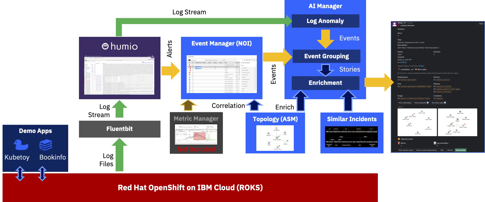

# Watson AIOps Demo Environment Installation

# **The official repo is now under the "AIOps - Up And Running" documentation:**

[https://github.ibm.com/up-and-running/watson-aiops/tree/master/docs/automations/nik_installation](https://github.ibm.com/up-and-running/watson-aiops/tree/master/docs/automations/nik_installation)


---------------------------------------------------------------------------------------------------------------
---------------------------------------------------------------------------------------------------------------


1. [Prerequisites](#prerequisites)
1. [Architecture](#architecture)
1. [AI and Event Manager Base Install](#ai-and-event-manager-base-install)
1. [Install Istio](#istio)
1. [Install Demo Apps](#demo-apps-in-ai-manager)
1. [Demo Apps in AI Manager](#demo-apps)
1. [Train the Models](#train-the-models)
1. [Humio Connection from AI Manager (Ops Integration)](#humio-connection-from-ai-manager-ops-integration)
1. [NOI Connection from AI Manager (Ops Integration)](#noi-connection-from-ai-manager-ops-integration)
1. [Install Humio](#humio)
1. [Configure Event Manager / ASM Topology](#configure-event-manager--asm-topology)
1. [Configure Runbooks](#configure-runbooks)
1. [Install Event Manager Gateway](#install-event-manager-gateway)
1. [Create ASM Integration in AI Manager](#create-asm-integration-in-ai-manager)
1. [Slack integration](#slack-integration)
1. [Some Polishing](#some-polishing)
1. [Demo Assets](#demo-assets)


---------------------------------------------------------------------------------------------------------------
## Introduction
------------------------------------------------------------------------------

This repository documents the progress of me learning to build a Watson AIOps demo environment.

This is provided `as-is`:

* I'm sure there are errors
* I'm sure it's not complete
* It clearly can be improved

So please if you have feedback contact me on Slack 
> Niklaus Hirt


---------------------------------------------------------------------------------------------------------------
## Prerequisites
------------------------------------------------------------------------------

### OpenShift requirements

I installed the demo in a ROKS environment.

You'll need:

- 5x worker nodes Flavor `b3c.16x64` (so 16 CPU / 64 GB)

You might get away with less if you don't install some components (Istio, ...)


### Tooling

You need the following tools installed in order to follow through this guide:

- gnu-sed (on Mac)
- oc
- jq
- kubectl
- kafkacat

```bash
brew install gnu-sed
brew install kafkacat
brew install jq
```


Get oc and kubectl from [here](https://github.com/openshift/okd/releases/)

or use :

```bash
wget https://github.com/openshift/okd/releases/download/4.6.0-0.okd-2021-02-14-205305/openshift-client-mac-4.6.0-0.okd-2021-02-14-205305.tar.gz -O oc.tar.gz
tar xfzv oc.tar.gz
mv kubectl /usr/local/bin
mv oc /usr/local/bin
```


------------------------------------------------------------------------------------------------------------------------------------------------------------------------------------------------------------------------------
## Architecture
------------------------------------------------------------------------------------------------------------------------------------------------------------------------------------------------------------------------------

The environement (Kubernetes, Applications, ...) create logs that are being fed into a Log Management Tool (Humio in this case).



The Log Management Tool (Humio) generates Alerts when it detects a problem and sends them into the Event Manager (Netcool Operations Insight), which in turn sends them to the AI Manager for Event Grouping.

At the same time AI Manager ingests the raw logs coming from the Log Management Tool (Humio) and looks for anomalies in the stream based on the trained model.
If it finds an anomaly it forwards it to the Event Grouping as well.

Out of this, AI Manager creates a Story that is being enriched with Topology (Localization and Blast Radius) and with Similar Incidents that might help correct the problem.

The Story is then sent to Slack.


------------------------------------------------------------------------------------------------------------------------------------------------------------------------------------------------------------------------------
## AI and Event Manager Base Install
------------------------------------------------------------------------------------------------------------------------------------------------------------------------------------------------------------------------------

### Adapt configuration

Adapt the 01_config-modules.sh file with the **Storage Class** (ibmc-file-gold-gid on ROKS) and the modules you want to install.

### Start installation

```bash
./10_install_aiops.sh -t <PULL_SECRET_TOKEN>
```

This will install:

- AI Manager
- Event Manager (NOI)
- ASM


---------------------------------------------------------------------------------------------------------------
## Istio 
------------------------------------------------------------------------------

Istio installation is optional and is used only for the Bookinfo app.

If you don't use Istio, you'll have to create a Route to the Productpage Pod.


```bash
oc create ns istio-system
```

Install:

- Elasticsearch Operator
- RedHat Jaeger Operator
- Kiali Operator
- Service Mesh Operator

- Create CR Service Mesh in istio-system (!)
- Create CR ServiceMeshMemberRoll in istio-system for bookinfo (!)


---------------------------------------------------------------------------------------------------------------
## Demo Apps in AI Manager
------------------------------------------------------------------------------


### Create Apps

Define an Application Group ( I call it DemoApps)
In this Group create three Applications:

- Bookinfo
- Kubetoy
- Sockshop


### Create Log Ops Integration

For Bookinfo and Sockshop:

In AI Manager on the App:
Create Ops Integration --> Apache Kafka --> Next --> Logs / Humio and use the mapping:

```yaml
{
    "rolling_time": 10,
    "instance_id_field": "kubernetes.container_name",
    "log_entity_types": "kubernetes.namespace_name,kubernetes.container_hash,kubernetes.host,kubernetes.container_name,kubernetes.pod_name",
    "message_field": "@rawstring",
    "timestamp_field": "@timestamp"
}
```


> **Important**: whenever you have to provide a mapping for Humio throughout this guide, please make sure that the `instance_id_field` is set to `kubernetes.container_name`


Jot down somewhere safe the AppGroup ID and the App IDs of what you just created.

To get them is to go on `Insight Models`, click `Configure` (the little pen), enter any version number and click `Generate`.

You get something like this:

```yaml
$EVENT_INGEST
 - zvqubqka.  --> AppGroup Id
    - yqyy711o. --> App Id
```

---------------------------------------------------------------------------------------------------------------
## Demo Apps
------------------------------------------------------------------------------

### Install Bookinfo

```bash
oc create ns bookinfo

oc apply -n bookinfo -f ./demo_install/bookinfo/bookinfo.yaml
oc apply -n bookinfo -f ./demo_install/bookinfo/bookinfo-gateway.yaml
oc apply -n bookinfo -f ./demo_install/bookinfo/destination-rule-all.yaml
oc apply -n bookinfo -f ./demo_install/bookinfo/virtual-service-reviews-100-v2.yaml

```


#### Install Bookinfo genereate load

This generates constant load on the Bookinfo app

```bash
oc apply -n default -f ./demo_install/bookinfo/bookinfo-create-load.yaml
```


### Install Kubetoy

```bash
kubectl create ns kubetoy
kubectl apply -n kubetoy -f ./demo_install/kubetoy/kubetoy_all_in_one.yaml

```


### Install SockShop 

```bash
kubectl create ns sock-shop

oc adm policy add-scc-to-user privileged -n sock-shop -z default
oc create clusterrolebinding default-sock-shop-admin --clusterrole=cluster-admin --serviceaccount=sock-shop:default

kubectl apply -n sock-shop -f ./demo_install/sockshop/sockshop-complete.yaml
```

#### Install SockShop genereate load

This generates constant load on the SockShop app

```bash
kubectl apply -n default -f ./demo_install/sockshop/sockshop-create-load.yaml
```


---------------------------------------------------------------------------------------------------------------
## Train the Models
------------------------------------------------------------------------------

### Prerequisite - adapt for ROKS S3 Storage

```bash
oc project zen 
oc exec $(oc get pods -l app.kubernetes.io/component=model-train-console -o jsonpath='{ .items[*].metadata.name }') -- sed -i 's/type: mount_cos/type: s3_datastore/g' /home/zeno/train/manifests/s3fs-pvc/event_group.yaml
oc exec $(oc get pods -l app.kubernetes.io/component=model-train-console -o jsonpath='{ .items[*].metadata.name }') -- sed -i 's/type: mount_cos/type: s3_datastore/g' /home/zeno/train/manifests/s3fs-pvc/event_group_eval.yaml
oc exec $(oc get pods -l app.kubernetes.io/component=model-train-console -o jsonpath='{ .items[*].metadata.name }') -- sed -i 's/type: mount_cos/type: s3_datastore/g' /home/zeno/train/manifests/s3fs-pvc/event_ingest.yaml
oc exec $(oc get pods -l app.kubernetes.io/component=model-train-console -o jsonpath='{ .items[*].metadata.name }') -- sed -i 's/type: mount_cos/type: s3_datastore/g' /home/zeno/train/manifests/s3fs-pvc/log_anomaly.yaml
oc exec $(oc get pods -l app.kubernetes.io/component=model-train-console -o jsonpath='{ .items[*].metadata.name }') -- sed -i 's/type: mount_cos/type: s3_datastore/g' /home/zeno/train/manifests/s3fs-pvc/log_anomaly_eval.yaml
oc exec $(oc get pods -l app.kubernetes.io/component=model-train-console -o jsonpath='{ .items[*].metadata.name }') -- sed -i 's/type: mount_cos/type: s3_datastore/g' /home/zeno/train/manifests/s3fs-pvc/log_ingest.yaml
oc exec $(oc get pods -l app.kubernetes.io/component=model-train-console -o jsonpath='{ .items[*].metadata.name }') -- sed -i 's/type: mount_cos/type: s3_datastore/g' /home/zeno/train/manifests/s3fs-pvc/log_ingest_eval.yaml

```


### Training

You have to train the following models.

Bookinfo:

- Log Anomaly
- Events
- Similar Incidents

Kubetoy:

- Events
- Similar Incidents

Sockshop:

- Log Anomaly
- Events
- Similar Incidents


You can find the steps in the `tools/5_training` folder.

[Training Bookinfo](./tools/5_training/TRAINING_BOOKINFO.md)

[Training Kubetoy](./tools/5_training/TRAINING_KUBETOY.md)

[Training Sockshop](./tools/5_training/TRAINING_SOCKSHOP.md)


Use the AppGroup and App IDs from the above step.

Please bear in mind that Event and Log Anomaly training takes some time!


---------------------------------------------------------------------------------------------------------------
## Humio Connection from AI Manager (Ops Integration)
------------------------------------------------------------------------------

### Create Ops Integration on Bookinfo App

Do this for Bookinfo and Sockshop

#### URL

Get the Humio URL from your browser

Add at the end `/api/v1/repositories/aiops/query`


#### Accounts Token

Get it from Humio --> Owl in the top right corner --> Your Account --> API Token

#### Filter
kubernetes.namespace_name="bookinfo"

or

kubernetes.namespace_name="sock-shop"

#### Mapping

```yaml
{
    "rolling_time": 10,
    "instance_id_field": "kubernetes.container_name",
    "log_entity_types": "kubernetes.namespace_name,kubernetes.container_hash,kubernetes.host,kubernetes.container_name,kubernetes.pod_name",
    "message_field": "@rawstring",
    "timestamp_field": "@timestamp"
}
```

---------------------------------------------------------------------------------------------------------------
## NOI Connection from AI Manager (Ops Integration)
------------------------------------------------------------------------------

Do this for Bookinfo, Sockshop and Kubetoy

Create Ops Integration

* Select Apache Kafka
* Next
* Data Source --> Events
* Ops integration mapping type --> Netcool


---------------------------------------------------------------------------------------------------------------
## HUMIO
------------------------------------------------------------------------------

### Install HUMIO

```bash
helm repo add humio https://humio.github.io/humio-helm-charts
helm repo update

oc create ns humio-logging

helm install humio-instance humio/humio-helm-charts \
  --namespace humio-logging \
  --values ./tools/4_integrations/humio/humio-install.yaml


oc adm policy add-scc-to-user privileged -n humio-logging -z humio-instance
oc adm policy add-scc-to-user privileged -n humio-logging -z default


kubectl apply -n humio-logging -f ./tools/4_integrations/humio/humio-route.yaml
```

You can get the login details like this:

```bash
username: "developer" (fixed)

# password
kubectl get secret developer-user-password -n humio-logging -o=template --template={{.data.password}} | base64 -D

```

#### Change developer password

If you want to modify the password you have to update the Secret `developer-user-password`

```yaml
kind: Secret
apiVersion: v1
metadata:
  name: developer-user-password
  namespace: humio-logging
data:
  password: UDRzc3cwcmQh
type: Opaque
```

Don't forget to base64 encode the password.


### Configure Humio

* Create Repository `aiops`
* Get Ingest token (Settings --> API tokens)


### Humio Fluentbit

```bash
export INGEST_TOKEN=ZsXyuLJrdKnZFqtLaTldvqsNhRYCmhFikLLQ9mBM1tDQ (put your token from above)

```

#### Install DaemonSet

```bash
oc adm policy add-scc-to-user privileged -n humio-logging -z humio-fluentbit-fluentbit-read


helm install humio-fluentbit humio/humio-helm-charts \
  --namespace humio-logging \
  --set humio-fluentbit.token=$INGEST_TOKEN \
  --values ./tools/4_integrations/humio/humio-agent.yaml
```


#### Modify DaemonSet

```bash
kubectl patch DaemonSet humio-fluentbit-fluentbit -n humio-logging -p '{"spec": {"template": {"spec": {"containers": [{"name": "humio-fluentbit","image": "fluent/fluent-bit:1.4.2","securityContext": {"privileged": true}}]}}}}' --type=merge

kubectl delete -n humio-logging pods -l k8s-app=humio-fluentbit
```


### Configure Humio Alerts


#### Create Notifier 

**In Event Manager (NOI):**

* Administration --> Integration with other Systems
* Incoming --> New Integration
* Humio
* Get Webhook URL

**In Humio:**

* Alerts --> Notifiers 
* New Notifier with URL and Skip Cert Validation


#### BookinfoProblem

```yaml
"kubernetes.namespace_name" = bookinfo
| @rawstring = /unable to contact http:\/\/ratings:9080\/ratings got status of 503/i

Last 5s

resource.name=\"ratings\" severity=Major resource.hostname=ratings type.eventType=\"bookinfo\"
```

#### BookinfoRatingsDown

```yaml
"kubernetes.namespace_name" = bookinfo
| @rawstring = /unable to contact http:\/\/ratings:9080\/ratings got status of 503/i

Last 5s

resource.name=\"ratings\" severity=Critical resource.hostname=ratings-v1 type.eventType=\"bookinfo\"
```


#### BookinfoReviewsProblem

```yaml
"kubernetes.namespace_name" = bookinfo
| @rawstring = /unable to contact http:\/\/ratings:9080\/ratings got status of 503/i

Last 5s

resource.name=\"reviews\" severity=Major resource.hostname=reviews-v2 type.eventType=\"bookinfo\"
```

#### KubetoyLivenessProbe

```yaml
"kubernetes.namespace_name" = kubetoy | @rawstring = /I'm not feeling all that well./i


Last 20s

resource.name=\"kubetoy-deployment\" severity=Critical resource.hostname=kubetoy-deployment type.eventType=\"kubetoy\"
```

#### KubetoyAvailabilityProblem

```yaml
"kubernetes.namespace_name" = kubetoy | @rawstring = /I'm not feeling all that well./i

Last 20s

resource.name=\"kubetoy-deployment\" severity=Major resource.hostname=kubetoy-service type.eventType=\"kubetoy\"
```


#### KubetoyCrash

```yaml
"kubernetes.namespace_name" = kubetoy | @rawstring = /app.js:187/i

Last 5 min

resource.name=\"kubetoy-deployment\" severity=Critical resource.hostname=kubetoy-service type.eventType=\"kubetoy\"
```


#### KubetoyGeneralError

```yaml
"kubernetes.namespace_name" = kubetoy | @rawstring = /error/i


Last 2s

resource.name=\"kubetoy-deployment\" severity=Critical resource.hostname=kubetoy-deployment type.eventType=\"kubetoy\"
```


#### SockShopAvailability

```yaml
"kubernetes.namespace_name" = sockshop | @rawstring = /app.js:187/i

Last 5 min

resource.name=\"sockshop\" severity=Critical resource.hostname=sockshop type.eventType=\"sockshop\"
```


#### SockShopCatalogError

```yaml
"kubernetes.namespace_name" = sockshop | @rawstring = /error/i


Last 2s

resource.name=\"sockshop\" severity=Critical resource.hostname=sockshop type.eventType=\"sockshop\"
```

> You can test by creating a Notifier with https://webhook.site/


---------------------------------------------------------------------------------------------------------------
## Configure Event Manager / ASM Topology
------------------------------------------------------------------------------

### Create User that can see Topology

* Log-in to Noi --> Netcool WebGUI --> Top Right click on cog --> WebSphere Administrative Console
* Users and Groups
* Manage Groups --> Create Group "admin" 
* Manage Users  --> Create User "demo" --> add to group admin
* In Netcool WebGUI --> Top Right click on cog --> Group Roles --> Give all rights


### Load Topologies for Sockshop and Bookinfo

./demo/maintenance.sh

Select option 11, 12 and 13.

This will create Topologies for the three Applications


### Create Templates

Go to Netcool WebGUI
Administration-->Topology Template

Create a template for Bookinfo and Sockshop:

Bookinfo:
* Search for productpage-v1 (deployment)
* Create Topology 3 Levels
* Select Dynamic
* Enable "Correlate event groups on topologies from this template"
* Add tag `app:bookinfo`
* Save

Sockshop:
* Search for front-end (deployment)
* Create Topology 3 Levels
* Select Dynamic
* Enable "Correlate event groups on topologies from this template"
* Add tag `app:sockshop`
* Save

Kubetoy:
* Search for kubetoy (deployment)
* Create Topology 3 Levels
* Select Static
* Enable "Correlate event groups on topologies from this template"
* Save


### Create grouping Policy

* NetCool Web Gui --> Insights --> Scope Based Grouping
* Create Policy
* On `Alert Group`


---------------------------------------------------------------------------------------------------------------
## Configure Runbooks
------------------------------------------------------------------------------

### Create Bastion Server

This creates a simple Pod with the needed tools (oc, kubectl) being used as a bastion host for Runbook Automation. 

```bash
kubectl apply -n default -f ./tools/6_bastion/create-bastion.yaml
```

### Create the NOI Integration

#### In NOI

* Go to  Administration --> Integration with other Systems --> Automation Type --> Script
* Copy the SSH KEY


#### Adapt SSL Certificate in Bastion Host Deployment. 

* Select the `bastion-host` Deployment in Namespace `default`
* Adapt Environment Variable SSH_KEY with the key you have copied above.


### Create Automation

Automation -->Runbooks --> Automations --> New Automation

Bookinfo

```bash
oc login --token=$token --server=$ocp_url
kubectl scale deployment --replicas=1 -n bookinfo ratings-v1
```

Sockshop

```bash
oc login --token=$token --server=$ocp_url
oc scale --replicas=1  deployment catalogue -n sock-shop
```

Use these default values

```yaml
target: bastion-host-service.default.svc
user:   root
$token	 : Token from your login (ACCESS_DETAILS_XXX.md)	
$ocp_url : URL from your login (ACCESS_DETAILS_XXX.md, something like https://c102-e.eu-de.containers.cloud.ibm.com:32236)		
```


### Create Runbooks

**Kubetoy Liveness Probe**

-------
Check if the Pod is still running
kubectl get pods -n NAMESPACE PODNAME 
If the return value is empty proceed with the next steps.

-------
Get the name of the Pod
kubectl get pods -n NAMESPACE | grep <your-pod-name>

-------
Check the logs
kubectl logs -n NAMESPACE kubetoy-deployment-<your-pod-id>

-------
Restart the pod if needed
kubectl delete pod -n NAMESPACE <your-pod-id>


**Bookinfo Reviews-Ratings**

Automated --> Use the Automation created above

**Sockshop Catalogue**

Automated --> Use the Automation created above


-------
### Add Runbook Triggers

Create new trigger for

* Kubetoy
* Bookinfo
* Sockshop

based on Alert Group


---------------------------------------------------------------------------------------------------------------
## Install Event Manager Gateway
------------------------------------------------------------------------------

### Create Strimzi route

Add Listener to Strimzi Operator CR in Namespace zen:


```bash
kubectl patch Kafka strimzi-cluster -n zen -p '{"spec": {"kafka": {"listeners": {"external": {"type": "route"}}}}}' --type=merge
```


### Copy secret strimzi-cluster-cluster-ca-cert

Copy secret strimzi-cluster-cluster-ca-cert - from  zen to noi

```bash
kubectl get secret strimzi-cluster-cluster-ca-cert -n zen -oyaml
```

* Clean out all the unneeded metadata and status info.
* Change Namespace to noi
* Apply


### Get needed info

Jot down the following information

```bash
oc get secret token -n zen --template={{.data.password}} | base64 --decode

oc get routes -n zen strimzi-cluster-kafka-bootstrap -o=jsonpath='{.status.ingress[0].host}{"\n"}'

oc get kafkatopic -n zen | grep alerts-noi
```

### Modify Template 

Copy the templates to be modified 

```bash
cp ./tools/3_integrationgateway/nikh-bookinfo-demo-noi-aimgr-gateway-config-template.yaml ./tools/3_integrationgateway/nikh-bookinfo-demo-noi-aimgr-gateway-config-template_XXXX.yaml
cp ./tools/3_integrationgateway/nikh-kubetoy-demo-noi-aimgr-gateway-config-template.yaml ./tools/3_integrationgateway/nikh-kubetoy-demo-noi-aimgr-gateway-config-template_XXXX.yaml
cp ./tools/3_integrationgateway/nikh-sockshop-demo-noi-aimgr-gateway-config-template.yaml ./tools/3_integrationgateway/nikh-sockshop-demo-noi-aimgr-gateway-config-template_XXXX.yaml

```

Replace TODO tags starting line 325 in the _XXX files

> Pay close attention to use the appropriate alerts-noi-xx-yy topic corresponding to your Application!


### Apply Manifest

```bash
kubectl apply -n noi -f ./tools/3_integrationgateway/nikh-bookinfo-demo-noi-aimgr-gateway-config-template_XXXX.yaml
kubectl apply -n noi -f ./tools/3_integrationgateway/nikh-bookinfo-demo-noi-aimgr-gateway.yaml

kubectl apply -n noi -f ./tools/3_integrationgateway/nikh-kubetoy-demo-noi-aimgr-gateway-config-template_XXXX.yaml
kubectl apply -n noi -f ./tools/3_integrationgateway/nikh-kubetoy-demo-noi-aimgr-gateway.yaml

kubectl apply -n noi -f ./tools/3_integrationgateway/nikh-sockshop-demo-noi-aimgr-gateway-config-template_XXXX.yaml
kubectl apply -n noi -f ./tools/3_integrationgateway/nikh-sockshop-demo-noi-aimgr-gateway.yaml

```


---------------------------------------------------------------------------------------------------------------
## Create ASM Integration in AI Manager
------------------------------------------------------------------------------

### Create the Operations integration for the AppGroup


#### Get certificate

Get the certificate:

```bash
oc get secret demo-noi-topology-topology-cert -n noi -o yaml | grep tls.crt | awk '{print $2}' | base64 -d
```

#### Input values

* Get Username from `./80_get__logins.sh`  (Usually something like demo-noi-topology-topology)
* Get Password from `./80_get_logins.sh`>

* Topology URL : https://demo-noi-topology-topology.noi.svc:8080
* Layout URL : https://demo-noi-topology-layout.noi.svc:7084
* Merge Service URL : https://demo-noi-topology-merge.noi.svc:7082
* Search URL : https://demo-noi-topology-search.noi.svc:7080
* UI URL : https://netcool.demo-noi.apps.ocp45.tec.uk.ibm.com. (adapt this to your NOI URL from your browser)
* UI API URL : https://demo-noi-topology-ui-api.noi.svc:3080


### Check ASM connection

```bash
oc exec $(oc get pod -n zen |grep topology | awk '{print $1}') -n zen bash -it

curl -X GET -k "https://localhost:8443/ready?send_additional_info=true" -H "accept: application/json"
```

Should respond with this:

```json
{"ready":"ok","asm_connections":{"initialized_from_remote":true,"default_connector":null,"connectors":{"ubtjc0h2":{"healthy":true,"last_response":{"topology_service":{"service":"IBM Topology","health":[{"responsetimeunit":"ms","serviceinput":"ping health node","serviceoutput":"node pinged ok","responsetime":3,"status":0}]},"search_service":{"service":"IBM Search Service","health":[{"responseTime":906210,"statusMessage":"Success","responseTimeUnit":"ms","status":0}]},"merge_service":{"service":"IBM Topology","health":[{"responsetimeunit":"ms","serviceinput":"ping health node","serviceoutput":"node pinged ok","responsetime":2,"status":0}]},"layout_service":{"service":"IBM Topology","health":[{"responsetimeunit":"ms","serviceinput":"ping health node","serviceoutput":"node pinged ok","responsetime":3,"status":0}]},"ui_api_service":{"service":"ASM UI API","status":"RUNNING"}}}}},"kafka_connection":"Consumer connected"}
```


---------------------------------------------------------------------------------------------------------------
## Slack integration
------------------------------------------------------------------------------


### Refresh ingress certificates (otherwise Slack will not validate link)

```bash
oc get secrets -n openshift-ingress | grep tls | grep -v router-metrics-certs-default | awk '{print $1}' | xargs oc get secret -n openshift-ingress -o yaml > tmpcert.yaml
cat tmpcert.yaml | grep " tls.crt" | awk '{print $2}' |base64 -d > cert.crt
cat tmpcert.yaml | grep " tls.key" | awk '{print $2}' |base64 -d > cert.key
ibm_nginx_pod=$(oc get pods -l component=ibm-nginx -o jsonpath='{ .items[0].metadata.name }')
oc exec ${ibm_nginx_pod} -- mkdir -p "/user-home/_global_/customer-certs"
oc cp cert.crt ${ibm_nginx_pod}:/user-home/_global_/customer-certs/
oc cp cert.key ${ibm_nginx_pod}:/user-home/_global_/customer-certs/
for i in `oc get pods -l component=ibm-nginx -o jsonpath='{ .items[*].metadata.name }' `; do oc exec ${i} -- /scripts/reload.sh; done
rm tmpcert.yaml cert.crt cert.key
```


### Intefration 

More details are [here](https://pages.github.ibm.com/up-and-running/watson-aiops/End_to_End_Demo_2.1/setup_the_demo/slack/slack/) 

A copy of those instructions are here: ./4_integrations/slack

Thanks Robert Barron!

### Change the Slash Welcome Message

If you want to change the welcome message

```bash
oc set env deployment/$(oc get deploy -l app.kubernetes.io/component=chatops-slack-integrator -o jsonpath='{.items[*].metadata.name }') SLACK_WELCOME_COMMAND_NAME=/aiops-help
```


---------------------------------------------------------------------------------------------------------------
## Some Polishing
------------------------------------------------------------------------------

### Make Flink Console accessible

If not done in the script 

```bash
oc create route passthrough job-manager -n zen --service=demo-ai-manager-ibm-flink-job-manager --port=8000
```


### Check if data is flowing

Get the kafkacat Certificate

```bash
mv ca.crt ca.crt.old
oc extract secret/strimzi-cluster-cluster-ca-cert -n zen --keys=ca.crt

oc get kafkatopic -n zen


export sasl_password=$(oc get secret token -n zen --template={{.data.password}} | base64 --decode)
export BROKER=$(oc get routes strimzi-cluster-kafka-bootstrap -n zen -o=jsonpath='{.status.ingress[0].host}{"\n"}'):443

kafkacat -v -X security.protocol=SSL -X ssl.ca.location=./ca.crt -X sasl.mechanisms=SCRAM-SHA-512 -X sasl.username=token -X sasl.password=$sasl_password -b $BROKER -o beginning -C -t derived-stories 
```


### Create USER

```bash
kubectl create serviceaccount -n zen demo-admin

oc create clusterrolebinding test-admin --clusterrole=cluster-admin --serviceaccount=zen:demo-admin
```

Get the login Token from secret demo-admin-token-xyz in Namespace zen

You can then login with:

```bash
oc login --server=https://<REPLACE>.containers.cloud.ibm.com:<REPLACE> --token=<TOKEN> 

```


### Change admin password AI Manager

Modify the `admin-user-details`secret in zen

Replace 

initial_admin_password: cGFzc3dvcmQ=

with 

initial_admin_password: UDRzc3cwcmQh

Restart Pod


# Demo Assets

Make sure you have updated the config file ./demo/01_config.sh


