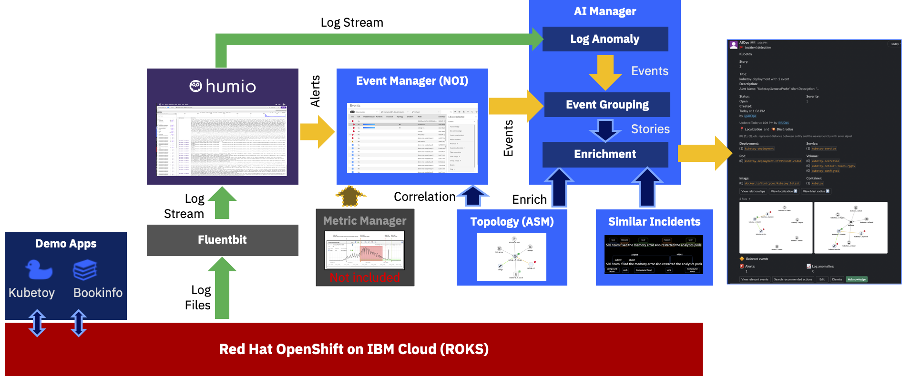
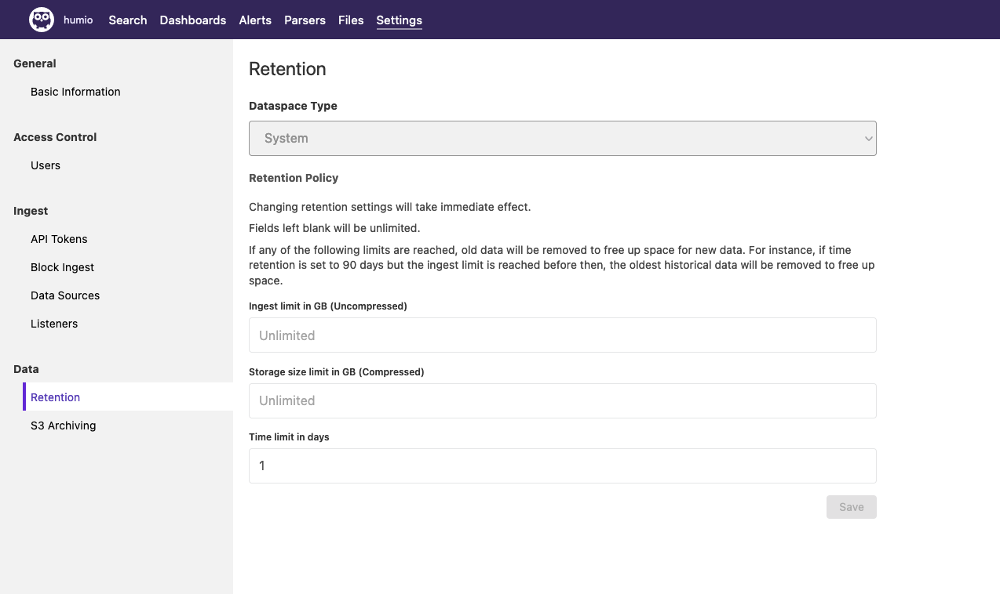
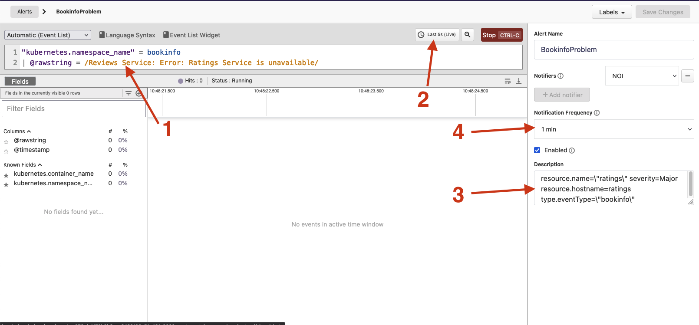
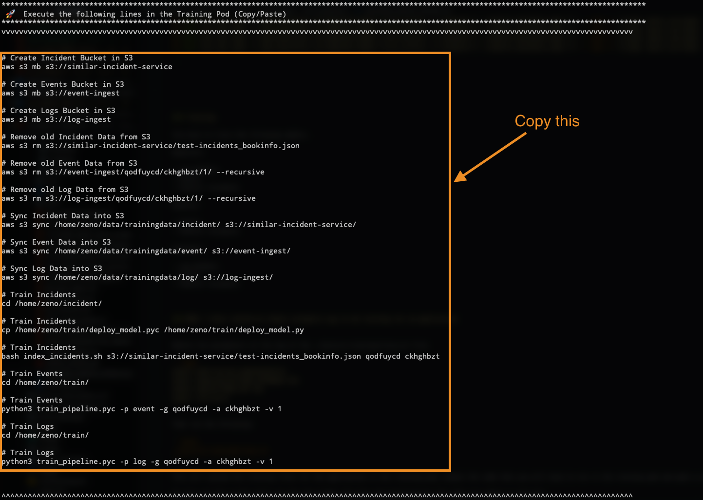
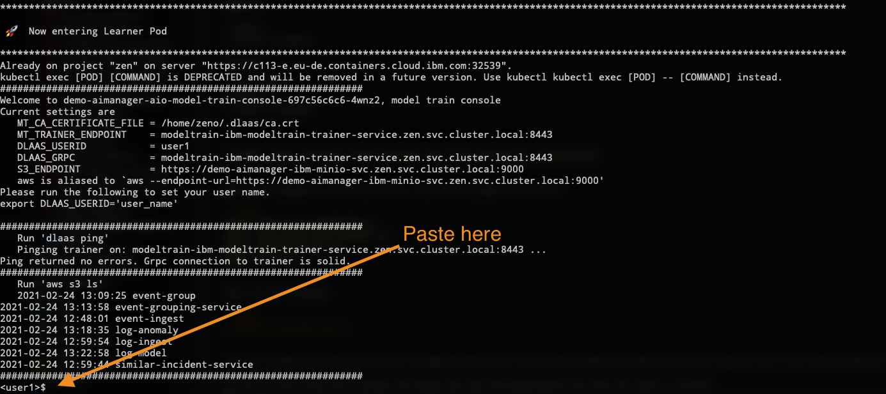

# Watson AIOps Demo Environment Installation


This is a collection of scripts from Niklaus Hirt to install Watson AIOps. The scripts can all be found in the https://github.ibm.com/up-and-running/watson-aiops/tree/master/docs/automations/nik_installation git repo under automations


---------------------------------------------------------------------------------------------------------------
## NEW: ℹ️ Offline Click Through Demo
------------------------------------------------------------------------------

If you need an easy and fast way to demo AIOps in an "almost real" way you can use the Click Through Demo built with PowerPoint.

The file is [AIOps INTERACTIVE DEMO 2021](./AIOps_INTERACTIVE_DEMO_2021_V9.ppsx) in this repository.


# Changes

| Date  | Description  | Files  | 
|---|---|---|
|  27 Feb 2021 | Modified install to increase HUMIO Kafka PVCs to 50GB  | ./tools/4_integrations/humio/humio-install.yaml  |
|  01 Mar 2021 | New version of Bookinfo  | bookinfo.yaml, training log files  |
|  02 Mar 2021 | Incident injection for Bookinfo with Git, Falco, Metrics and Instana  | Demo files in bookinfo  |
|  03 Mar 2021 | Stripped control characters for non zsh shells  | Installation files  |
|  04 Mar 2021 | Added install checklist  | README_INSTALLATION_CHECKLIST.md  |
|   |   |   | 


---------------------------------------------------------------------------------------------------------------
# Installation
---------------------------------------------------------------------------------------------------------------

1. [Prerequisites](#prerequisites)
1. [Architecture](#architecture)
1. [AI and Event Manager Base Install](#ai-and-event-manager-base-install)
1. [Demo Apps in AI Manager](#demo-apps)
1. [Install Demo Apps](#demo-apps-in-ai-manager)
1. [Create NOI Webhooks](#noi-webhooks)
1. [Install Humio](#humio)
1. [Train the Models](#train-the-models)
1. [Connections from AI Manager (Ops Integration)](#connections-from-ai-manager-ops-integration)
1. [Configure Event Manager / ASM Topology](#configure-event-manager--asm-topology)
1. [Configure Runbooks](#configure-runbooks)
1. [Install Event Manager Gateway](#install-event-manager-gateway)
1. [Create ASM Integration in AI Manager](#create-asm-integration-in-ai-manager)
1. [Slack integration](#slack-integration)
1. [Some Polishing](#some-polishing)
1. [Demo Assets](#demo-assets)


> ❗You can find a handy install checklist here: [INSTALLATION CHECKLIST](./README_INSTALLATION_CHECKLIST.md).


---------------------------------------------------------------------------------------------------------------
## Introduction
------------------------------------------------------------------------------

This repository documents the progress of me learning to build a Watson AIOps demo environment.

This is provided `as-is`:

* I'm sure there are errors
* I'm sure it's not complete
* It clearly can be improved

So please if you have any feedback contact me 

- on Slack: Niklaus Hirt or
- by Mail: nikh@ch.ibm.com


---------------------------------------------------------------------------------------------------------------
## Prerequisites
------------------------------------------------------------------------------

### OpenShift requirements

I installed the demo in a ROKS environment.

You'll need:

- 4x worker nodes Flavor `b3c.16x64` (so 16 CPU / 64 GB)

You might get away with less if you don't install some components (Humio,...)


### Tooling

You need the following tools installed in order to follow through this guide:

- gnu-sed (on Mac)
- oc
- jq
- kubectl
- kafkacat
- helm 3

```bash
/bin/bash -c "$(curl -fsSL https://raw.githubusercontent.com/Homebrew/install/HEAD/install.sh)"
brew install gnu-sed
brew install kafkacat
brew install jq
```


Get oc and kubectl from [here](https://github.com/openshift/okd/releases/)

or use :

```bash
wget https://github.com/openshift/okd/releases/download/4.6.0-0.okd-2021-02-14-205305/openshift-client-mac-4.6.0-0.okd-2021-02-14-205305.tar.gz -O oc.tar.gz
tar xfzv oc.tar.gz
mv kubectl /usr/local/bin
mv oc /usr/local/bin
```

### Get the scripts and code

Download the Zip of this repository.

The scripts are in /docs/automations/nik_installation

```bash
cd docs/automations/nik_installation
```

------------------------------------------------------------------------------------------------------------------------------------------------------------------------------------------------------------------------------
## Architecture
------------------------------------------------------------------------------------------------------------------------------------------------------------------------------------------------------------------------------

The environement (Kubernetes, Applications, ...) create logs that are being fed into a Log Management Tool (Humio in this case).



The Log Management Tool (Humio) generates Alerts when it detects a problem and sends them into the Event Manager (Netcool Operations Insight), which in turn sends them to the AI Manager for Event Grouping.

At the same time AI Manager ingests the raw logs coming from the Log Management Tool (Humio) and looks for anomalies in the stream based on the trained model.
If it finds an anomaly it forwards it to the Event Grouping as well.

Out of this, AI Manager creates a Story that is being enriched with Topology (Localization and Blast Radius) and with Similar Incidents that might help correct the problem.

The Story is then sent to Slack.

At the same time Event Manager launches an automated Runbook to correct the problem (scale up the Bookinfo Ratings deployment).


------------------------------------------------------------------------------------------------------------------------------------------------------------------------------------------------------------------------------
## AI and Event Manager Base Install
------------------------------------------------------------------------------------------------------------------------------------------------------------------------------------------------------------------------------

### Adapt configuration

Adapt the 01_config-modules.sh file with the **Storage Class** (ibmc-file-gold-gid on ROKS) and the modules you want to install.

Make sure that you are logged into your cluster!

### Start installation

```bash
./10_install_aiops.sh -t <PULL_SECRET_TOKEN>
```

This will install:

- AI Manager
- Event Manager (NOI)
- ASM


### Create NOI User that can see Topology

* Log-in to Noi (you can get all login information by running `./80_get_logins.sh`)
* Netcool WebGUI --> Top Right click on cog --> WebSphere Administrative Console
* Users and Groups
* Manage Groups --> Create Group "admin" 
* Manage Users  --> Create User "demo" --> add to group admin
* In Netcool WebGUI --> Top Right click on cog --> Group Roles --> Give all rights


---------------------------------------------------------------------------------------------------------------
## Demo Apps in AI Manager
------------------------------------------------------------------------------

**ℹ️ I have removed the need to install Istio.**

### Create Dummy Slack integration

In order to be able to continue with defining the Application structure in AIManager you have to create a bogus/dummy slack integration.

1. Make sure you're on demo-aimanager
2. Click on Ops Integration --> Create Ops Integration
3. Name the integration `Slack`
4. Put in any string for `Bot User OAuth access token`and `Signing secret`

### Create Apps

Define an Application Group (I call it DemoApps)
In this Group create three Applications:

- Bookinfo
- Kubetoy
- Sockshop

> In my latest demos I create a separate AppGroup per Application to get a different Slack channel per App.
> 
> But you have to do the Topology integration 3 times.


Jot down somewhere safe the AppGroup ID and the App IDs of what you just created.

To get them is to go for each Application on `Insight Models`, click `Configure` (the little pen), enter any version number and click `Generate`.

You get something like this:

```yaml
$EVENT_INGEST
 - zvqubqka.  --> AppGroup Id
    - yqyy711o. --> App Id
```

---------------------------------------------------------------------------------------------------------------
## Demo Apps
------------------------------------------------------------------------------

### Install Bookinfo

**ℹ️❗As of March 1st, I have pushed a new version of Bookinfo:**

- New all black and blue look with AIOps book instead of Shakespeare
- Modified all componenets to create more log output to make log anomaly detection more reliable

Images are on my Docker Hub (niklaushirt).
The sources are [here](https://github.com/pirsoscom/bookinfo).


```bash
oc create ns bookinfo

oc apply -n bookinfo -f ./demo_install/bookinfo/bookinfo.yaml

```

> Note: if you want to use the classic version, please use `./demo_install/bookinfo/bookinfo-classic.yaml`
> 
> And you also have to do the training with the `log-bookinfo-classic.json.gz` file


#### Install Bookinfo generate load

This generates constant load on the Bookinfo app

```bash
oc apply -n default -f ./demo_install/bookinfo/bookinfo-create-load.yaml
```


### Install Kubetoy

```bash
kubectl create ns kubetoy
kubectl apply -n kubetoy -f ./demo_install/kubetoy/kubetoy_all_in_one.yaml

```


### Install SockShop 

```bash
kubectl create ns sock-shop

oc adm policy add-scc-to-user privileged -n sock-shop -z default
oc create clusterrolebinding default-sock-shop-admin --clusterrole=cluster-admin --serviceaccount=sock-shop:default

kubectl apply -n sock-shop -f ./demo_install/sockshop/sockshop-complete.yaml
```

#### Install SockShop generate load

This generates constant load on the SockShop app

```bash
kubectl apply -n default -f ./demo_install/sockshop/sockshop-create-load.yaml
```


---------------------------------------------------------------------------------------------------------------
## NOI Webhooks
------------------------------------------------------------------------------

Create Webhooks in NOI for Event injection and incident simulation for the Demo.

The `demo.sh` script (in the `demo` folder) gives you the possibility to simulate an outage without relying on the integrations with other systems.

At this time it simulates:
- Git push event
- Humio Events
- Metrics CPU Event
- Humio Events
- Instana Events


You have to define the Webhooks in Event Manager (NOI):


### Humio Webhook

* Administration --> Integration with other Systems
* Incoming --> New Integration
* Humio

Name it `Humio` and jot down the WebHook URL.


### Falco Webhook (optional)

* Administration --> Integration with other Systems
* Incoming --> New Integration
* Webhook

Name it `Falco` and jot down the WebHook URL.

Use this json:

```json
{
  "priority": "Critical",
  "rule": "K8s Deployment Created",
  "output_fields": {
    "k8s.ns.name": "bookinfo",
    "k8s.pod.name": "ratings-v1"
  }
}
```

Fill out the following fields and save:

* Severity: `priority`
* Summary: `"[Falco]  -  " & rule`
* Resource name: `output_fields."k8s.pod.name"`
* Event type: `output_fields."k8s.ns.name"`


### Git Webhook (optional)

* Administration --> Integration with other Systems
* Incoming --> New Integration
* Webhook

Name it `Git` and jot down the WebHook URL.

Use this json:

```json
{
  "pusher": {
    "name": "niklaushirt"
  },
  "created": false,
  "repository": {
    "name": "bookinfo"
  },
  "head_commit": {
    "message": "MY COMMIT MESSAGE",
    "modified": [
      "bookinfo.yaml"
    ],
    "committer": {
      "name": "Niklaus Hirt"
    },
    "url": "https://github.com/pirsoscom/aiops-demo/commit/09d12b3974d3b875b8f1e818f700894ed76ffffc"
  }
}
```

Fill out the following fields and save:

* Severity: `"Warning"`
* Summary: `"[Git] Commit in repository "  & repository.name & " by " & head_commit.committer.name & " on file " & head_commit.modified[0] & " - " & head_commit.message`
* Resource name: `repository.name`
* Event type: `repository.name`
* URL1: `head_commit.url` and `Commit` 


### Metrics Webhook (optional)

* Administration --> Integration with other Systems
* Incoming --> New Integration
* Webhook

Name it `Metrics` and jot down the WebHook URL.

Use this json:

```json
{
  "ruleName": "High CPU usage in Pod Detected",
  "evalMatches": [
    {
      "value": 0.2680797094110499,
      "tags": {
        "namespace": "bookinfo",
        "service": "reviews-v1"
      }
    }
  ],
  "title": "[Alerting] High CPU"
}
```

Fill out the following fields and save:

* Severity: `"Major"`
* Summary: `"[Metrics] - " & title & "  -  " & ruleName & " at " & evalMatches[0].value & "%"`
* Resource name: `evalMatches[0].tags.service`
* Event type: `evalMatches[0].tags.namespace`
* URL1: `ruleUrl` and `URL` 


### Instana Webhook (optional)

* Administration --> Integration with other Systems
* Incoming --> New Integration
* Webhook

Name it `Instana` and jot down the WebHook URL.

Use this json:

```json
{
  "issue": {
    "container": "ratings-v1",
    "suggestion": "The value **resources/limits** has changed",
    "text": "Change detected",
    "service": "bookinfo",
    "link": "https://pirsoscom.github.io/Instana_Event_Change%20detected.html",
    "severity": 10
  }
}
```

Fill out the following fields and save:

* Severity: `issue.severity = 10 ? "Critical" : issue.severity = 7 ? "Major" : issue.severity = 5 ? "Minor"`
* Summary: `"[Instana] " & issue.text & "  - "  & issue.suggestion`
* Resource name: `issue.container`
* Event type: `issue.service`
* URL1: `issue.link` and `Instana` 


### Copy the Webhook URLS

Copy the Webhook URLs that you have jotted down and insert them into the `./demo/01_config.sh` file on the corresponding line.

If you don't want a certain type of alert, just leave the `NETCOOL_WEBHOOK_XXX=not_configured`. This will suppress the simulation for this type.


### Create NOI Menu item - Open URL

in the Netcool WebGUI

* Go to Administration-->Tool Configuration
* Click on `LaunchRunbook`
* Copy it (the middle button with the two sheets)
* Name it `Launch URL`
* Replace the Script Command with the following code

	```javascript
	var urlId = '{$selected_rows.URL}';
	
	if (urlId == '') {
	    alert('This event is not linked to an URL');
	} else {
	    var wnd = window.open(urlId, '_blank');
	}
	```
* Save

Then 

* Go to Administration-->Menu Configuration
* Select `alerts`
* Click on `Modify`
* Move Launch URL to the right column
* Save


### Create NOI Menu item - Delete Events

This creates a menu entry that deletes all events that have the same AlertGroup as the selected line.

in the Netcool WebGUI

* Go to Administration-->Tool Configuration
* Click on `delete`
* Copy it (the middle button with the two sheets)
* Name it `deleteEvents`
* Replace the SQL Command with the following code

	```sql
  delete from alerts.details where Identifier in ((select Identifier from alerts.status where AlertGroup in ($selected_rows.AlertGroup))); delete from alerts.status where AlertGroup in ($selected_rows.AlertGroup);delete from alerts.journal where Serial in ((select Serial from alerts.status where AlertGroup in ($selected_rows.AlertGroup)));
	```
* Save

Then 

* Go to Administration-->Menu Configuration
* Select `alerts`
* Click on `Modify`
* Move `deleteEvents` to the right column
* Save


---------------------------------------------------------------------------------------------------------------
## HUMIO
------------------------------------------------------------------------------

> ❗I have upped the size of the Kafka PVCs to 50GB as the standard 5GB was way too low. This is done automatically

### Install HUMIO

```bash
helm repo add humio https://humio.github.io/humio-helm-charts
helm repo update

oc create ns humio-logging

helm install humio-instance humio/humio-helm-charts \
  --namespace humio-logging \
  --values ./tools/4_integrations/humio/humio-install.yaml


oc adm policy add-scc-to-user privileged -n humio-logging -z humio-instance
oc adm policy add-scc-to-user privileged -n humio-logging -z default


kubectl apply -n humio-logging -f ./tools/4_integrations/humio/humio-route.yaml
```

You can get the login details like this:

```bash
username: "developer" (fixed)

# password
kubectl get secret developer-user-password -n humio-logging -o=template --template={{.data.password}} | base64 -D

```

#### Change developer password

If you want to modify the password you have to update the Secret `developer-user-password`

```yaml
kind: Secret
apiVersion: v1
metadata:
  name: developer-user-password
  namespace: humio-logging
data:
  password: UDRzc3cwcmQh
type: Opaque
```

Don't forget to base64 encode the password.

```bash
echo "my-password" | base64
```

And restart the `humio-instance-humio-core-0` Pod !


### Configure Humio

* Create Repository `aiops`
* Get Ingest token (Settings --> API tokens)

### Limit retention

#### Change retention size for aiops

You have to change the retention options for the aiops repository


#### Change retention size for humio

You have to change the retention options for the humio repository




### Humio Fluentbit

```bash
export INGEST_TOKEN=ZsXyuLJrdKnZFqtLaTldvqsNhRYCmhFikLLQ9mBM1tDQ (put your token from above)

```

#### Install DaemonSet

```bash
oc adm policy add-scc-to-user privileged -n humio-logging -z humio-fluentbit-fluentbit-read


helm install humio-fluentbit humio/humio-helm-charts \
  --namespace humio-logging \
  --set humio-fluentbit.token=$INGEST_TOKEN \
  --values ./tools/4_integrations/humio/humio-agent.yaml
```


#### Modify DaemonSet

```bash
kubectl patch DaemonSet humio-fluentbit-fluentbit -n humio-logging -p '{"spec": {"template": {"spec": {"containers": [{"name": "humio-fluentbit","image": "fluent/fluent-bit:1.4.2","securityContext": {"privileged": true}}]}}}}' --type=merge

kubectl apply -n humio-logging -f ./tools/4_integrations/humio/FluentbitDaemonSet_DEBUG.yaml


kubectl delete -n humio-logging pods -l k8s-app=humio-fluentbit


```


### Configure Humio Notifier 

**In Humio:**

Go to:

* `aiops` repository
* Alerts --> Notifiers 
* New Notifier with the Noi Webhook URL from [above](#humio-webhook) and Skip Cert Validation


### Create Alerts


Click on Alerts -> `+ New Alert`

Create the following Alerts as shown in the picture



#### BookinfoProblem

```yaml
"kubernetes.namespace_name" = bookinfo
| @rawstring = /Reviews Service: Error: Ratings Service is unavailable/

Last 5s

resource.name=\"ratings\" severity=Major resource.hostname=ratings type.eventType=\"bookinfo\"

Notification Frequency: 1 min
```

#### BookinfoRatingsDown

```yaml
"kubernetes.namespace_name" = bookinfo
| @rawstring = /Reviews Service: Error: Ratings Service is unavailable/

Last 5s

resource.name=\"ratings\" severity=Critical resource.hostname=ratings-v1 type.eventType=\"bookinfo\"

Notification Frequency: 1 min
```


#### BookinfoReviewsProblem

```yaml
"kubernetes.namespace_name" = bookinfo
| @rawstring = /Reviews Service: Error: Ratings Service is unavailable/

Last 5s

resource.name=\"reviews\" severity=Major resource.hostname=reviews-v2 type.eventType=\"bookinfo\"

Notification Frequency: 1 min
```

#### KubetoyLivenessProbe

```yaml
"kubernetes.namespace_name" = kubetoy | @rawstring = /I'm not feeling all that well./i


Last 20s

resource.name=\"kubetoy-deployment\" severity=Critical resource.hostname=kubetoy-deployment type.eventType=\"kubetoy\"

Notification Frequency: 1 min
```

#### KubetoyAvailabilityProblem

```yaml
"kubernetes.namespace_name" = kubetoy | @rawstring = /I'm not feeling all that well./i

Last 20s

resource.name=\"kubetoy-deployment\" severity=Major resource.hostname=kubetoy-service type.eventType=\"kubetoy\"

Notification Frequency: 1 min
```


#### SockShopAvailability

```yaml
"kubernetes.namespace_name" = sock-shop 
| "kubernetes.pod_name" = /carts|front-end/i |  "kubernetes.pod_name" != /carts-db|catalogue-db/i | stripAnsiCodes(@rawstring)
| "@rawstring" = /catalogue 500 /i

Last 5s

resource.name=\"front-end\" severity=Critical resource.hostname=front-end type.eventType=\"sockshop\"

Notification Frequency: 1 min
```


#### SockShopCatalogue

```yaml
"kubernetes.namespace_name" = sock-shop 
| "kubernetes.pod_name" = /carts|front-end/i |  "kubernetes.pod_name" != /carts-db|catalogue-db/i | stripAnsiCodes(@rawstring)
| "@rawstring" = /catalogue 500 /i

Last 5s

resource.name=\"catalogue\" severity=Critical resource.hostname=catalogue type.eventType=\"sockshop\"

Notification Frequency: 1 min
```

> You can test by creating a Notifier with https://webhook.site/


---------------------------------------------------------------------------------------------------------------
## Train the Models
------------------------------------------------------------------------------

### Prerequisite - adapt for ROKS S3 Storage

```bash
oc project zen 
oc exec $(oc get pods -l app.kubernetes.io/component=model-train-console -o jsonpath='{ .items[*].metadata.name }') -- sed -i 's/type: mount_cos/type: s3_datastore/g' /home/zeno/train/manifests/s3fs-pvc/event_group.yaml
oc exec $(oc get pods -l app.kubernetes.io/component=model-train-console -o jsonpath='{ .items[*].metadata.name }') -- sed -i 's/type: mount_cos/type: s3_datastore/g' /home/zeno/train/manifests/s3fs-pvc/event_group_eval.yaml
oc exec $(oc get pods -l app.kubernetes.io/component=model-train-console -o jsonpath='{ .items[*].metadata.name }') -- sed -i 's/type: mount_cos/type: s3_datastore/g' /home/zeno/train/manifests/s3fs-pvc/event_ingest.yaml
oc exec $(oc get pods -l app.kubernetes.io/component=model-train-console -o jsonpath='{ .items[*].metadata.name }') -- sed -i 's/type: mount_cos/type: s3_datastore/g' /home/zeno/train/manifests/s3fs-pvc/log_anomaly.yaml
oc exec $(oc get pods -l app.kubernetes.io/component=model-train-console -o jsonpath='{ .items[*].metadata.name }') -- sed -i 's/type: mount_cos/type: s3_datastore/g' /home/zeno/train/manifests/s3fs-pvc/log_anomaly_eval.yaml
oc exec $(oc get pods -l app.kubernetes.io/component=model-train-console -o jsonpath='{ .items[*].metadata.name }') -- sed -i 's/type: mount_cos/type: s3_datastore/g' /home/zeno/train/manifests/s3fs-pvc/log_ingest.yaml
oc exec $(oc get pods -l app.kubernetes.io/component=model-train-console -o jsonpath='{ .items[*].metadata.name }') -- sed -i 's/type: mount_cos/type: s3_datastore/g' /home/zeno/train/manifests/s3fs-pvc/log_ingest_eval.yaml

```


### Training

You have to train the following models.

Bookinfo:

- Log Anomaly
- Events
- Similar Incidents

Kubetoy:

- Events
- Similar Incidents

Sockshop:

- Log Anomaly
- Events
- Similar Incidents


### NEW: Almost automatic way to do training for an application

You will have to do this for each of the three applications!

Modify the parameters at the top of the `./tools/5_training/train-<APP>.sh` file:

```yaml
#-----------------------------------------------------------------------------------------------------------------------------------------------------------------------------------------------------------------------
# ADAPT VALUES
#-----------------------------------------------------------------------------------------------------------------------------------------------------------------------------------------------------------------------
export application_name=<APP>. (bookinfo, sockshop, kubetoy)
export appgroupid=<YOUR APPGROUP ID>
export appid=<YOUR APP ID>
export version=1
```

Then run the following:

```bash
./tools/5_training/train-<APP>.sh
```

This will:

* upload the training files for the application to the training pod
* output the code that you will have to run in the training pod and 
* open a shell in the training pod.

So just run the script until you get the prompt.

Then copy the code a bit further up




and paste/execute the code in the pod.




This will train the three models for the application you have selected.

### ℹ️❗I suggest you copy block by block to be able to check if all is going as planned


### Or you can use the manual way of doing


You can find the steps in the `tools/5_training` folder.

[Training Bookinfo](./tools/5_training/TRAINING_BOOKINFO.md)

[Training Kubetoy](./tools/5_training/TRAINING_KUBETOY.md)

[Training Sockshop](./tools/5_training/TRAINING_SOCKSHOP.md)


Use the AppGroup and App IDs from the above step.

Please bear in mind that Event and Log Anomaly training takes some time!


---------------------------------------------------------------------------------------------------------------
## Connections from AI Manager (Ops Integration)
------------------------------------------------------------------------------

### Create Humio Ops Integrations

Do this for Bookinfo and Sockshop

#### URL

Get the Humio URL from your browser

Add at the end `/api/v1/repositories/aiops/query`


#### Accounts Token

Get it from Humio --> Owl in the top right corner --> Your Account --> API Token

#### Filter

```yaml
"kubernetes.namespace_name" = bookinfo
| "kubernetes.container_name" = reviews
```

or

```yaml
"kubernetes.namespace_name" = sock-shop
| "kubernetes.container_name" = front-page
```

#### Mapping

```yaml
{
    "rolling_time": 10,
    "instance_id_field": "kubernetes.container_name",
    "log_entity_types": "kubernetes.namespace_name,kubernetes.container_hash,kubernetes.host,kubernetes.container_name,kubernetes.pod_name",
    "message_field": "@rawstring",
    "timestamp_field": "@timestamp"
}
```

> **❗Important**: whenever you have to provide a mapping for Humio throughout this guide, please make sure that the `instance_id_field` is set to `kubernetes.container_name`


### Create NOI Ops Integration


Do this for Bookinfo, Sockshop and Kubetoy

Create Ops Integration

* Select Apache Kafka
* Next
* Data Source --> Events
* Ops integration mapping type --> Netcool


### Create Log Ops Integration

For Bookinfo:

In AI Manager on the App:
Create Ops Integration --> Apache Kafka --> Next --> Logs / Humio and use the mapping:

```yaml
{
    "rolling_time": 10,
    "instance_id_field": "kubernetes.container_name",
    "log_entity_types": "kubernetes.namespace_name,kubernetes.container_hash,kubernetes.host,kubernetes.container_name,kubernetes.pod_name",
    "message_field": "@rawstring",
    "timestamp_field": "@timestamp"
}
```


> **❗Important**: whenever you have to provide a mapping for Humio throughout this guide, please make sure that the `instance_id_field` is set to `kubernetes.container_name`


---------------------------------------------------------------------------------------------------------------
## Configure Event Manager / ASM Topology
------------------------------------------------------------------------------


### Create Observer to Load Topologies

* In NOI go into Administration --> Topology Management --> ObserverJobs --> Configure --> Add a new Job
* Select REST --> Configure
* Choose “listen”
* Set Unique ID to “listenJob” (important!)
* Set Provider to whatever you like (usually I set it to “listenJob” as well)
* Save

### Load Topologies for Sockshop and Bookinfo

```bash
cd demo
./load_topology.sh
```

Select option 1, 2 or 3.

This will create Topologies for the three Applications


### Create Templates

Go to Netcool WebGUI
Administration-->Topology Template

Create a template for Bookinfo and Sockshop:

Bookinfo:
* Search for productpage-v1 (deployment)
* Create Topology 3 Levels
* Select Dynamic
* Enable "Correlate event groups on topologies from this template"
* Add tag `app:bookinfo`
* Save

Sockshop:
* Search for front-end (deployment)
* Create Topology 3 Levels
* Select Dynamic
* Enable "Correlate event groups on topologies from this template"
* Add tag `app:sockshop`
* Save

Kubetoy:
* Search for kubetoy (deployment)
* Create Topology 3 Levels
* Select Static
* Enable "Correlate event groups on topologies from this template"
* Save


### Create grouping Policy

* NetCool Web Gui --> Insights --> Scope Based Grouping
* Create Policy
* On `Alert Group`


---------------------------------------------------------------------------------------------------------------
## Configure Runbooks
------------------------------------------------------------------------------

### Create Bastion Server

This creates a simple Pod with the needed tools (oc, kubectl) being used as a bastion host for Runbook Automation. 

```bash
kubectl apply -n default -f ./tools/6_bastion/create-bastion.yaml
```

### Create the NOI Integration

#### In NOI

* Go to  Administration --> Integration with other Systems --> Automation Type --> Script
* Copy the SSH KEY


#### Adapt SSL Certificate in Bastion Host Deployment. 

* Select the `bastion-host` Deployment in Namespace `default`
* Adapt Environment Variable SSH_KEY with the key you have copied above.


### Create Automation

Automation -->Runbooks --> Automations --> New Automation

Bookinfo

```bash
oc login --token=$token --server=$ocp_url
kubectl scale deployment --replicas=1 -n bookinfo ratings-v1
```

Sockshop

```bash
oc login --token=$token --server=$ocp_url
oc scale --replicas=1  deployment catalogue -n sock-shop
```

Use these default values

```yaml
target: bastion-host-service.default.svc
user:   root
$token	 : Token from your login (ACCESS_DETAILS_XXX.md)	
$ocp_url : URL from your login (ACCESS_DETAILS_XXX.md, something like https://c102-e.eu-de.containers.cloud.ibm.com:32236)		
```


### Create Runbooks

**Kubetoy Liveness Probe**

```yaml
-------
Check if the Pod is still running
kubectl get pods -n NAMESPACE PODNAME 
If the return value is empty proceed with the next steps.

-------
Get the name of the Pod
kubectl get pods -n NAMESPACE | grep <your-pod-name>

-------
Check the logs
kubectl logs -n NAMESPACE kubetoy-deployment-<your-pod-id>

-------
Restart the pod if needed
kubectl delete pod -n NAMESPACE <your-pod-id>
```


**Bookinfo Reviews-Ratings**

Automated --> Use the Automation created above

**Sockshop Catalogue**

Automated --> Use the Automation created above


-------
### Add Runbook Triggers

Create new trigger for

* Kubetoy
* Bookinfo
* Sockshop

based on Alert Group


---------------------------------------------------------------------------------------------------------------
## Install Event Manager Gateway
------------------------------------------------------------------------------

### Create Strimzi route

Add Listener to Strimzi Operator CR in Namespace zen:


```bash
kubectl patch Kafka strimzi-cluster -n zen -p '{"spec": {"kafka": {"listeners": {"external": {"type": "route"}}}}}' --type=merge
```


### Copy secret strimzi-cluster-cluster-ca-cert

Copy secret strimzi-cluster-cluster-ca-cert - from  zen to noi

```bash
kubectl get secret strimzi-cluster-cluster-ca-cert -n zen -oyaml
```

* Clean out all the unneeded metadata and status info.
* Change Namespace to noi
* Apply


### Get needed info

Jot down the following information

```bash
oc get secret token -n zen --template={{.data.password}} | base64 --decode

oc get routes -n zen strimzi-cluster-kafka-bootstrap -o=jsonpath='{.status.ingress[0].host}{"\n"}'

oc get kafkatopic -n zen | grep alerts-noi
```

### Modify Template 

Copy the templates to be modified 

```bash
cp ./tools/3_integrationgateway/nikh-bookinfo-demo-noi-aimgr-gateway-config-template.yaml ./tools/3_integrationgateway/nikh-bookinfo-demo-noi-aimgr-gateway-config-template_XXXX.yaml
cp ./tools/3_integrationgateway/nikh-kubetoy-demo-noi-aimgr-gateway-config-template.yaml ./tools/3_integrationgateway/nikh-kubetoy-demo-noi-aimgr-gateway-config-template_XXXX.yaml
cp ./tools/3_integrationgateway/nikh-sockshop-demo-noi-aimgr-gateway-config-template.yaml ./tools/3_integrationgateway/nikh-sockshop-demo-noi-aimgr-gateway-config-template_XXXX.yaml

```

Replace TODO tags starting line 325 in the _XXX files

> Pay close attention to use the appropriate alerts-noi-xx-yy topic corresponding to your Application!


### Apply Manifest

```bash
kubectl apply -n noi -f ./tools/3_integrationgateway/nikh-bookinfo-demo-noi-aimgr-gateway-config-template_XXXX.yaml
kubectl apply -n noi -f ./tools/3_integrationgateway/nikh-bookinfo-demo-noi-aimgr-gateway.yaml

kubectl apply -n noi -f ./tools/3_integrationgateway/nikh-kubetoy-demo-noi-aimgr-gateway-config-template_XXXX.yaml
kubectl apply -n noi -f ./tools/3_integrationgateway/nikh-kubetoy-demo-noi-aimgr-gateway.yaml

kubectl apply -n noi -f ./tools/3_integrationgateway/nikh-sockshop-demo-noi-aimgr-gateway-config-template_XXXX.yaml
kubectl apply -n noi -f ./tools/3_integrationgateway/nikh-sockshop-demo-noi-aimgr-gateway.yaml

```


---------------------------------------------------------------------------------------------------------------
## Create ASM Integration in AI Manager
------------------------------------------------------------------------------

### Create the Operations integration for the AppGroup


#### Get certificate

Get the certificate:

```bash
oc get secret demo-noi-topology-topology-cert -n noi -o yaml | grep tls.crt | awk '{print $2}' | base64 -d
```

#### Input values

* Get Username from `./80_get__logins.sh`  (Usually something like demo-noi-topology-topology)
* Get Password from `./80_get_logins.sh`>

* Topology URL : https://demo-noi-topology-topology.noi.svc:8080
* Layout URL : https://demo-noi-topology-layout.noi.svc:7084
* Merge Service URL : https://demo-noi-topology-merge.noi.svc:7082
* Search URL : https://demo-noi-topology-search.noi.svc:7080
* UI URL : https://netcool.demo-noi.apps.ocp45.tec.uk.ibm.com. (adapt this to your NOI URL from your browser)
* UI API URL : https://demo-noi-topology-ui-api.noi.svc:3080


### Check ASM connection

```bash
oc exec $(oc get pod -n zen |grep topology | awk '{print $1}') -n zen bash -it

curl -X GET -k "https://localhost:8443/ready?send_additional_info=true" -H "accept: application/json"
```

Should respond with this:

```json
{"ready":"ok","asm_connections":{"initialized_from_remote":true,"default_connector":null,"connectors":{"ubtjc0h2":{"healthy":true,"last_response":{"topology_service":{"service":"IBM Topology","health":[{"responsetimeunit":"ms","serviceinput":"ping health node","serviceoutput":"node pinged ok","responsetime":3,"status":0}]},"search_service":{"service":"IBM Search Service","health":[{"responseTime":906210,"statusMessage":"Success","responseTimeUnit":"ms","status":0}]},"merge_service":{"service":"IBM Topology","health":[{"responsetimeunit":"ms","serviceinput":"ping health node","serviceoutput":"node pinged ok","responsetime":2,"status":0}]},"layout_service":{"service":"IBM Topology","health":[{"responsetimeunit":"ms","serviceinput":"ping health node","serviceoutput":"node pinged ok","responsetime":3,"status":0}]},"ui_api_service":{"service":"ASM UI API","status":"RUNNING"}}}}},"kafka_connection":"Consumer connected"}
```


---------------------------------------------------------------------------------------------------------------
## Slack integration
------------------------------------------------------------------------------


### Refresh ingress certificates (otherwise Slack will not validate link)

```bash
oc get secrets -n openshift-ingress | grep tls | grep -v router-metrics-certs-default | awk '{print $1}' | xargs oc get secret -n openshift-ingress -o yaml > tmpcert.yaml
cat tmpcert.yaml | grep " tls.crt" | awk '{print $2}' |base64 -d > cert.crt
cat tmpcert.yaml | grep " tls.key" | awk '{print $2}' |base64 -d > cert.key
ibm_nginx_pod=$(oc get pods -l component=ibm-nginx -o jsonpath='{ .items[0].metadata.name }')
oc exec ${ibm_nginx_pod} -- mkdir -p "/user-home/_global_/customer-certs"
oc cp cert.crt ${ibm_nginx_pod}:/user-home/_global_/customer-certs/
oc cp cert.key ${ibm_nginx_pod}:/user-home/_global_/customer-certs/
for i in `oc get pods -l component=ibm-nginx -o jsonpath='{ .items[*].metadata.name }' `; do oc exec ${i} -- /scripts/reload.sh; done
rm tmpcert.yaml cert.crt cert.key
```


### Integration 

More details are [here](https://pages.github.ibm.com/up-and-running/watson-aiops/End_to_End_Demo_2.1/setup_the_demo/slack/slack/) 

A copy of those instructions are here: ./4_integrations/slack

Thanks Robert Barron!

### Change the Slash Welcome Message

If you want to change the welcome message

```bash
oc set env deployment/$(oc get deploy -l app.kubernetes.io/component=chatops-slack-integrator -o jsonpath='{.items[*].metadata.name }') SLACK_WELCOME_COMMAND_NAME=/aiops-help
```


---------------------------------------------------------------------------------------------------------------
## Some Polishing
------------------------------------------------------------------------------

### Make Flink Console accessible

If not done in the script 

```bash
oc create route passthrough job-manager -n zen --service=demo-ai-manager-ibm-flink-job-manager --port=8000
```

### Check if installation is ok

Get the kafkacat Certificate

```bash
cd demo
./check-aiops-install.sh
```


### Check if data is flowing

Get the kafkacat Certificate

```bash
mv ca.crt ca.crt.old
oc extract secret/strimzi-cluster-cluster-ca-cert -n zen --keys=ca.crt

oc get kafkatopic -n zen


export sasl_password=$(oc get secret token -n zen --template={{.data.password}} | base64 --decode)
export BROKER=$(oc get routes strimzi-cluster-kafka-bootstrap -n zen -o=jsonpath='{.status.ingress[0].host}{"\n"}'):443

kafkacat -v -X security.protocol=SSL -X ssl.ca.location=./ca.crt -X sasl.mechanisms=SCRAM-SHA-512 -X sasl.username=token -X sasl.password=$sasl_password -b $BROKER -o beginning -C -t derived-stories 
```


### Create USER

```bash
kubectl create serviceaccount -n zen demo-admin

oc create clusterrolebinding test-admin --clusterrole=cluster-admin --serviceaccount=zen:demo-admin
```

Get the login Token from secret demo-admin-token-xyz in Namespace zen

You can then login with:

```bash
oc login --server=https://<REPLACE>.containers.cloud.ibm.com:<REPLACE> --token=<TOKEN> 

```


### Change admin password AI Manager

Modify the `admin-user-details`secret in zen

Replace 

initial_admin_password: cGFzc3dvcmQ=

with 

initial_admin_password: UDRzc3cwcmQh

Restart Pod


# Demo Assets

Make sure you have updated the config file ./demo/01_config.sh


